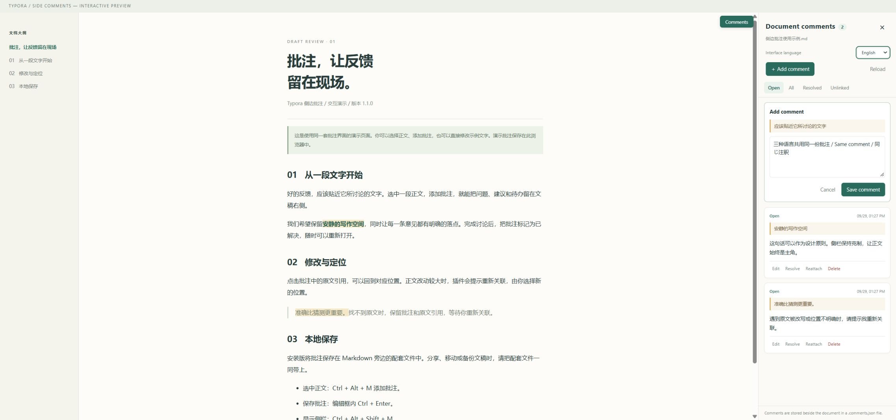

# Typora Side Comments 1.1.0

[简体中文](README.md) | [English](README.en.md) | 日本語

プラグインの UI とドキュメントは **簡体字中国語・英語・日本語** に対応しています。

文字を選択し、右側のサイドバーに注釈を追加できます。Windows 版 Typora 向けに、**Typora 1.14.10** の読み込み構造とインターフェースに基づいて開発しました。

これは独立した非公式拡張機能です。`typora_plugin` フレームワーク全体のインストールは不要で、MIT ライセンスを採用しています。1.0.0 について、Windows 版 Typora 1.14.10 へのインストール、サイドバーの表示、選択範囲の引用、注釈入力欄が開くことを実機で確認済みです。**注釈の保存、文書を開き直した際の復元、キーボードショートカットは、実機での検証がまだ完了していません。** まずはサンプル文書でお試しください。



## 表示言語

サイドバー上部の **界面语言 / Interface language / 表示言語** から切り替えると、すぐに反映されます。起動時は保存済みの選択を優先し、未設定の場合はシステムまたはブラウザーの対応言語を使用します。中国語の地域別表記は簡体字中国語に統一し、非対応の言語では英語を使用します。選択は注釈ファイルとは別にローカル保存されます。ホストがローカルストレージを禁止していても切り替えはできますが、次回の起動時に保持されない場合があります。

ボタン、通知、エラーメッセージ、日時の表示形式が切り替わり、下書き、引用、保存中の状態は保持されます。本文、ファイル名、入力した注釈は翻訳しません。インストーラーのコンソール表示は英語です。

1.0.0 から更新する場合は、文書を保存して Typora を閉じ、新しいインストーラーを実行してください。注釈ファイルの形式は変わりません。**1.1.0 の実際の Typora へのインストールと動作検証は未実施です。** 以下の実機記録は 1.0.0 のものです。

## インストール

1. GitHub リポジトリで **Code → Download ZIP** をクリックし、ソースコード一式をフォルダーに展開します。インストールスクリプトだけをコピーしないでください。
2. 文書を保存し、すべての Typora ウィンドウを閉じます。
3. Windows PowerShell を管理者として開き、展開したフォルダーで次のコマンドを実行します。

   ```powershell
   powershell -NoProfile -ExecutionPolicy Bypass -File .\Install.ps1
   ```

   このプロセスに適用する `Bypass` は、システムの実行ポリシーを変更しません。既定のインストール先は `C:\Program Files\Typora` です。Typora を別の場所にインストールしている場合は、次のように指定します。

   ```powershell
   powershell -NoProfile -ExecutionPolicy Bypass -File .\Install.ps1 -TyporaDirectory 'D:\Apps\Typora'
   ```

   インストール内容を実行せずに確認するには、`-WhatIf` を追加します。

4. Typora を開き直すと、右側に「文書の注釈」が表示されます。まず同梱の `示例文稿.md` で確認してから、実際の文書に使用してください。

インストーラーはパッケージ内のファイルの SHA-256 を検証し、`resources\window.html` をバックアップして、6 つのプラグインファイルをコピーします。また、開始と終了を明示するマーカー付きのスクリプト読み込み箇所を追加します。Typora のライセンス、文書、ユーザー設定、フォルダーのアクセス権は変更しません。ハッシュ検証はパッケージ内のファイルの破損を検出するためのものであり、デジタル署名ではありません。

## 使い方

| 操作 | 方法 |
|---|---|
| 注釈を追加する | 同一段落内の文字を選択し、右側の **「注釈を追加」** をクリックします。右クリックメニューまたは **Ctrl + Alt + M** にも対応していますが、この 2 つの方法は実機での検証がまだ完了していません |
| 注釈を保存する | 「注釈を保存」をクリックするか、注釈入力欄で **Ctrl + Enter** を押します |
| 原文の位置に移動する | 注釈カード内の原文の引用をクリックします |
| 議論を完了する | 「解決」をクリックします。「解決済み」タブの「再開」から再開できます |
| 編集または削除する | カードの下部にある「編集」または「削除」をクリックします。削除時には確認が必要です |
| 原文と再関連付けする | 本文で新しい位置の文字を選択し、該当するカードの「再関連付け」をクリックしてから保存します |
| サイドバーを表示・非表示にする | フローティング表示の「注釈」ボタンをクリックするか、**Ctrl + Alt + Shift + M** を押します |

初版では、同一の本文段落、見出し、リスト項目内の文字に対応しています。通常の太字、斜体、リンクの文字にも対応しています。画面上で段落が自動的に折り返されても問題ありません。複数の段落にまたがる選択範囲、表、コードブロック、数式、画像、HTML ブロック、Typora の `:emoji:` や HTML エンティティなどの特殊なインライン要素には、現在対応していません。直接入力した Unicode 絵文字は、通常の文字と一緒に保存できます。

ソースコードモードでは、注釈の追加と原文への移動を一時停止します。現在の選択範囲の右クリックメニューには「注釈を追加」が表示されます。それ以外の場所では、Typora 標準のメニューを使用します。注釈の内容はプレーンテキストとして表示され、含まれる HTML やスクリプトは実行されません。

## 注釈の保存先

たとえば、文書が `设计说明.md` の場合、同じフォルダーに次のファイルが作成されます。

```text
设计说明.md
设计说明.md.comments.json        注釈と原文の引用
设计说明.md.comments.json.bak    直近の保存が成功する前の注釈
```

注釈はローカルファイルに自動的に書き込まれます。ネットワークへのアップロードや Markdown 本文の変更は行いません。注釈の保存と、Typora による本文の保存は別の操作です。終了前には本文も保存してください。文書を開き直すと、対応する注釈ファイルが読み込まれます。

- **文書を移動、名前変更、別名保存、共有する場合は、対応する注釈ファイルも一緒に扱う必要があります。** 「名前を付けて保存」では注釈ファイルは自動コピーされません。注釈を引き継ぐには、元の注釈ファイルをコピーし、新しい文書の完全なファイル名に `.comments.json` を付けた名前に変更してください。
- 注釈には、選択した原文と、その前後それぞれ最大 64 文字が含まれます。注釈ファイルを共有すると、これらの内容も共有されます。
- 保存先のフォルダーには書き込み権限が必要です。未保存の文書には注釈を追加できません。読み取り専用フォルダー、書き込み失敗、ファイル破損の場合は明確なメッセージを表示し、未保存の注釈入力は現在のウィンドウに保持します。
- プラグインを使用するウィンドウ間では、ファイルロックとバージョン確認を行います。ウィンドウ内の一覧はリアルタイムには同期されません。競合が検出された場合は、未保存の内容をコピーし、編集をキャンセルして「再読み込み」をクリックしてから操作してください。
- プラグインが保存している間に、外部エディターや同期ソフトで同じ注釈ファイルを書き換えないでください。このファイルロックに従わない外部プログラムを制約することはできません。また、最終段階のバージョン確認も、プログラム間での原子的な比較・置換ではありません。
- 未保存の入力は現在のプロセス内にのみ保持されます。ブラウザーのような離脱確認が機能するかどうかは、Typora 側がその確認を受け入れるかどうかによります。ウィンドウを閉じる際の確認に下書きの保護を頼らず、先に「注釈を保存」をクリックしてください。

## 原文を変更した場合の動作

文書に変更がない場合は、元の位置を使って原文を特定します。文書が変更された場合は、引用した原文とその前後の文脈全体を見つけ、信頼できる一致が 1 か所だけであることを確認する必要があります。作成時点で同じ文脈が重複していた注釈は、文書の変更後に再関連付けを求めます。これにより、一方の箇所を削除した結果、別の箇所に誤って関連付けられることを避けます。

これは慎重なテキスト照合であり、エディターが標準で提供する範囲追従機能ではありません。注釈対象の文字自体やその前後の文脈を変更したり、段落構造を調整したりすると、注釈に「再関連付けが必要」と表示される場合があります。注釈の内容は保持されます。複雑な重複、移動、書き換えについて、テキスト照合だけで同一性を数学的に保証することはできません。疑わしい場合は引用を確認し、手動で関連付けてください。

## 復元とアンインストール

**ファイルが破損した場合**：まず Typora を閉じ、現在の `.comments.json` をバックアップします。`.comments.json.bak` の内容を確認してから、バックアップを使って復元してください。プラグインが破損したファイルを自動的に空の状態にリセットすることはありません。

**クラッシュ後にロックが残っていると表示される場合**：まず文書を保存してすべての Typora ウィンドウを閉じ、他のプログラムが注釈ファイルを操作していないことを確認してから、文書と同じフォルダーにある `文稿.md.comments.json.lock` を削除してください。削除するのはこの `.lock` ファイルだけです。`.comments.json` や `.bak` は削除しないでください。文書を開き直して「再読み込み」をクリックします。プログラムがロックを自動的に奪うことはありません。

**アンインストール**：文書を保存して Typora を閉じ、管理者として開いた PowerShell でパッケージのフォルダーから次のコマンドを実行します。

```powershell
powershell -NoProfile -ExecutionPolicy Bypass -File .\Uninstall.ps1
```

アンインストールでは、プラグイン自身の読み込み箇所と、このプラグインに属することがマーカーで確認できるディレクトリだけを削除します。文書、注釈、インストール時のバックアップはすべて残ります。Typora の更新後のファイルを、古い `window.html` で上書きすることはありません。

Typora を更新すると、プラグインの読み込み箇所が上書きされる場合があります。更新後は互換性を再確認してから、インストールスクリプトを実行してください。将来のバージョンとの互換性は保証できません。

## 操作デモと検証

同梱の `demo.html` を Chrome または Edge で開くと、同じサイドバーを体験できます。デモの注釈はブラウザーのローカルストレージにのみ保存されます。本文の編集内容は保存されず、利用者の Markdown ファイルを操作することもありません。

自動チェックの記録です。シミュレーション環境での結果は、Typora 実機での検証を意味しません。

- **1.1.0：Node テスト 21 項目**（データ・アンカー 14 項目、言語 7 項目）：翻訳の網羅性、言語判定、ストレージ利用不可、エラー変換、日時形式、既存のデータ検証。
- **1.1.0：ブラウザーチェック 41 項目**：3 言語の表示、言語設定の保持、下書きとカーソル、保存中の切り替え、エラーの再翻訳、削除確認、文書の切り替え、原文の関連付け、日時、幅 360px の画面、模擬ホストでの読み込み。実際の言語メニュー操作でも、選択した引用が保持されることを確認しました。
- 1.0.0 の過去の記録：実際の Chromium ブラウザーによるチェック 28 項目：追加、再読み込み、編集、解決、原文への移動、再関連付け、削除、HTML のテキスト表示、失敗時の入力保持、保存中のファイル切り替え、A→B→A、特殊な選択範囲、ソースコードモード、狭いウィンドウ、ダークモード、印刷、シミュレーションしたホスト環境での読み込み・切り替え・アンロード。
- インストールとアンインストールのチェック 15 項目を、隔離された模擬インストールディレクトリで実施：プレビュー、繰り返しのインストール、利用者による変更の保持、初回インストール失敗時のクリーンアップ、アップグレード失敗時のロールバック。Windows PowerShell 5.1 で実行済みであり、実際の Typora インストールディレクトリは操作しません。
- 実機で確認済みの項目（2026-09-24、Windows 版 Typora 1.14.10）：インストール、サイドバーの表示、文字を選択してボタンから注釈入力欄を開く操作、原文の引用が正しく表示されること。実機での保存、文書を開き直した際の復元、原文への移動、キーボードショートカットの検証は未完了です。他のバージョンとの互換性は未確認です。複数人での共同作業、返信スレッド、Word のコメントのインポート・エクスポート、PDF・Word 出力時の注釈の出力には、現在対応していません。

開発時の検証には、**Node.js 22 以降**、Windows PowerShell 5.1、インストール済みの Chrome が必要です。npm パッケージのインストールは不要です。

```powershell
node --test tests/core-storage.test.cjs tests/i18n.test.cjs
node tests/browser.test.cjs
powershell -NoProfile -ExecutionPolicy Bypass -File .\tests\installer.test.ps1
```

新しい 3 言語のブラウザーテストは、ローカル静的サーバーでパッケージを配信し、`tests/browser-suite.html` を開いて **Run checks** をクリックします。結果はページに表示されます。デモデータのみを使用し、終了後に以前のデモデータと言語設定を復元します。

ブラウザーテストは、既定で `C:/Program Files/Google/Chrome/Application/chrome.exe` を使用します。インストール先が異なる場合は、`tests/browser.test.cjs` 内のパスを変更してください。一時的なブラウザープロファイルと隔離されたヘッドレスウィンドウを使用し、テスト時には `preview.png` を再生成します。インストールテストで使用するのは、一時的な模擬ディレクトリだけです。

`plugin/` 内のファイルを変更した場合は、インストールできるように `SHA256.json` も更新する必要があります。ダウンロードまたはクローン後のハッシュがマニフェストと一致するよう、プラグインファイルには改行コードを変換しない設定を適用しています。

## 参考資料と実装について

- [Obsidian Inline Review Comments](https://github.com/ric604189-design/obsidian-inline-review-comments)：サイドバー操作、原文の引用、解決状態、保存前のスナップショット確認の設計を参考にしました。このプロジェクトはアンカーを Markdown に直接書き込みますが、本プラグインは文書に対応する別ファイルを使用し、同プロジェクトの `%%` 構文や Obsidian のエディターインターフェースはコピーしていません。
- [typora_plugin の開発インターフェース](https://github.com/obgnail/typora_plugin/blob/master/plugin/DEVELOP_PLUGINS.md)と[文書読み込みイベント](https://github.com/obgnail/typora_plugin/blob/master/plugin/global/core/utils/eventHub.js)：ローカルパス、Node インターフェース、本文の読み込みタイミングの確認に使用しました。

本パッケージのコードは独立した実装であり、[MIT ライセンス](LICENSE)を採用しています。元のプロジェクト名とリンクは、参考にした資料を明示するために記載しています。
